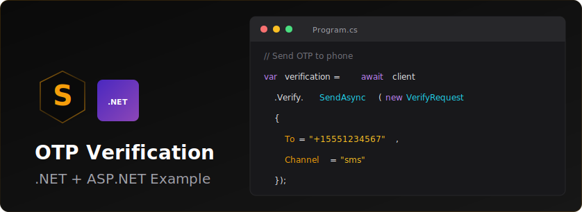

<p align="center">
  
</p>


# Sendly .NET OTP Verification Example

A complete ASP.NET Core example demonstrating phone number verification using the Sendly API.

## Features

- Send OTP codes via SMS
- Verify OTP codes
- Modern, responsive UI
- Minimal API architecture
- In-memory OTP storage

## Prerequisites

- .NET 8.0 SDK or later
- Sendly API key

## Setup

1. Install dependencies:
```bash
dotnet restore
```

2. Configure your Sendly API key in `appsettings.json`:
```json
{
  "Sendly": {
    "ApiKey": "your_sendly_api_key_here"
  }
}
```

Alternatively, set it as an environment variable:
```bash
export Sendly__ApiKey="your_sendly_api_key_here"
```

## Running the Application

```bash
dotnet run
```

The application will start at `http://localhost:5000` (or `https://localhost:5001` for HTTPS).

## How It Works

1. User enters their phone number on the home page
2. Server sends an OTP code using `client.Verify.SendAsync()`
3. User receives SMS with verification code
4. User enters the code on the verification page
5. Server verifies the code using `client.Verify.CheckAsync()`
6. User is notified of success or failure

## API Endpoints

### POST /send-otp
Send a verification code to a phone number.

**Request:**
```json
{
  "phone": "+1234567890"
}
```

**Response:**
```json
{
  "success": true,
  "verificationId": "ver_..."
}
```

### POST /verify-otp
Verify an OTP code.

**Request:**
```json
{
  "phone": "+1234567890",
  "code": "123456"
}
```

**Response:**
```json
{
  "success": true,
  "message": "Phone number verified successfully!"
}
```

## Project Structure

```
.
├── Program.cs              # Main application and API endpoints
├── SendlyOtpExample.csproj # Project configuration
├── appsettings.json        # Configuration file
├── wwwroot/
│   ├── index.html          # Phone number input page
│   └── verify.html         # OTP verification page
└── README.md
```

## Technologies Used

- ASP.NET Core 8.0 Minimal APIs
- Sendly .NET SDK (v3.10.0)
- Vanilla JavaScript (no frameworks)
- HTML5 & CSS3

## Security Notes

- This example uses in-memory storage for simplicity
- In production, use a distributed cache (Redis, SQL, etc.)
- Always validate phone number format
- Implement rate limiting to prevent abuse
- Use HTTPS in production
- Never commit your API key to version control

## Learn More

- [Sendly Documentation](https://sendly.live/docs)
- [Sendly .NET SDK](https://github.com/SendlyHQ/sendly-dotnet)
- [ASP.NET Core Documentation](https://learn.microsoft.com/aspnet/core)
